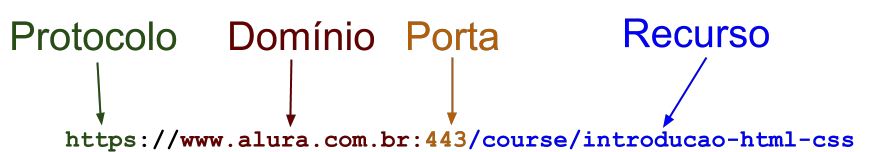
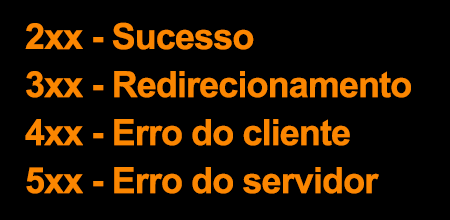
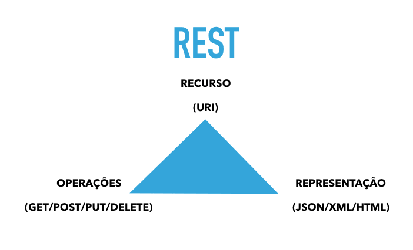

<h1>HTTP e HTTPS</h1>

<h2>Aula 1</h2>
    <ul>
        <li>Um protocolo é um conjunto de regras</li>
        <li>HTTP é um protocolo que define as regras de comunicação entre cliente e servidor na internet</li>
        <li>HTTP é o protocolo mais importante da Internet</li>
    </ul>

<h2>Aula 2</h2>
    <ul>
        <li>Por padrão, os dados são trafegados como texto puro na web</li>
        <li>Apenas com HTTPS a Web é segura</li>
        <li>O protocolo HTTPS nada mais é do que o protocolo HTTP mais uma camada adicional de segurança, a TLS/SSL</li>
        <li>Certificados digitais provam uma identidade para um site, onde temos informações sobre o seu domínio e a data de expiração desse certificado.</li>
        <li>As chaves públicas estão no certificado, a chave privada fica apenas no servidor</li>
        <li>Uma autoridade certificadora (CA - Certificate Authority) é um órgão que garante ao navegador e ao usuário que a identidade de um servidor é realmente válida</li>
        <li>O navegador utiliza a chave pública para criptografar os dados</li>
    </ul>

<h2>Aula 3</h2>
    <ul>
        <li>Uma URL começa com o protocolo (por exemplo https://) seguido pelo domínio (www.alura.com.br)</li>
        <li>Depois do domínio pode vir a porta, se não for definida é utilizada a porta padrão desse protocolo</li>
        <li>Após o domínio:porta, é especificado o caminho para um recurso (/course/introducao-html-css)</li>
        <li>Um recurso é algo concreto na aplicação que queremos acessar</li>
    </ul>

<h2>Estrutura URL</h2>
    

<h2>Aula 4</h2>
    <ul>
        <li>O protocolo HTTP segue o modelo Requisição-Resposta</li>
        <li>Sempre o cliente inicia a comunicação</li>
        <li>Uma requisição precisa ter todas as informações para o servidor gerar a resposta</li>
        <li>HTTP é stateless, não mantém informações entre requisições</li>
        <li>As plataformas de desenvolvimento usam sessões para guardar informações entre requisições</li>
    </ul>

<h2>Aula 5 - Códigos de resposta (Status Code)<h2>
    

<h2>Aula 6 - Métodos HTTP</h2>
    <ul>
        <li>GET --> Receber dados (Parâmetros na ULR)</li>
        <li>POST --> Submeter dados (Parâmetros no corpo da requisição)</li>
        <li>DELETE --> Remover um recurso</li>
        <li>PUT --> Atualizar um recurso</li>
    </ul>

<h2>Aula 7 - REST</h2>
    <ul>
        <li>REST é um padrão arquitetural para comunicações entre aplicações</li>
        <li>Recursos são definidos via URI</li>
        <li>Accept/Content-Type são usados para especificar as representações(JSON,XML,...)</li>
    </ul>
    